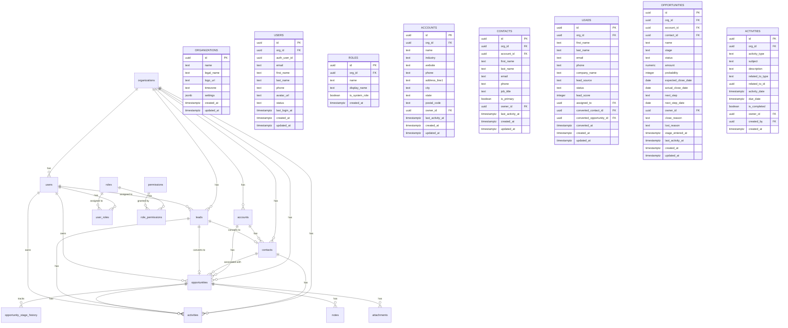

# CRM Core Data Model Specification

**Version**: 1.0.0
**Last Updated**: December 23, 2025
**Status**: Phase 0 - Product Spec

---

## Table of Contents

1. [Entity Relationship Diagram](#entity-relationship-diagram)
2. [Core Tables](#core-tables)
3. [CRM Tables](#crm-tables)
4. [Stage Definitions](#stage-definitions)
5. [KPI Dictionary](#kpi-dictionary)
6. [Roles & Permissions Matrix](#roles--permissions-matrix)

---

## Entity Relationship Diagram



---

## Core Tables

### organizations
The tenant table for multi-tenancy support.

| Column | Type | Constraints | Description |
|--------|------|-------------|-------------|
| id | UUID | PK, DEFAULT gen_random_uuid() | Primary key |
| name | TEXT | NOT NULL | Organization name |
| legal_name | TEXT | | Legal business name |
| logo_url | TEXT | | Logo image URL |
| timezone | TEXT | DEFAULT 'America/New_York' | Default timezone |
| settings | JSONB | DEFAULT '{}' | Organization settings |
| created_at | TIMESTAMPTZ | NOT NULL DEFAULT NOW() | Creation timestamp |
| updated_at | TIMESTAMPTZ | NOT NULL DEFAULT NOW() | Last update timestamp |

### users
User accounts linked to Supabase Auth.

| Column | Type | Constraints | Description |
|--------|------|-------------|-------------|
| id | UUID | PK, DEFAULT gen_random_uuid() | Primary key |
| org_id | UUID | FK → organizations(id), NOT NULL | Organization reference |
| auth_user_id | UUID | UNIQUE, NOT NULL | Supabase Auth user ID |
| email | TEXT | NOT NULL | Email address |
| first_name | TEXT | NOT NULL | First name |
| last_name | TEXT | NOT NULL | Last name |
| phone | TEXT | | Phone number |
| avatar_url | TEXT | | Profile image URL |
| status | TEXT | DEFAULT 'active' | active, suspended, deactivated |
| last_login_at | TIMESTAMPTZ | | Last login timestamp |
| created_at | TIMESTAMPTZ | NOT NULL DEFAULT NOW() | Creation timestamp |
| updated_at | TIMESTAMPTZ | NOT NULL DEFAULT NOW() | Last update timestamp |

### roles
Role definitions for RBAC.

| Column | Type | Constraints | Description |
|--------|------|-------------|-------------|
| id | UUID | PK, DEFAULT gen_random_uuid() | Primary key |
| org_id | UUID | FK → organizations(id), NOT NULL | Organization reference |
| name | TEXT | NOT NULL | Role name (admin, manager, ae) |
| display_name | TEXT | NOT NULL | Human-readable name |
| is_system_role | BOOLEAN | DEFAULT FALSE | Cannot be deleted if true |
| created_at | TIMESTAMPTZ | NOT NULL DEFAULT NOW() | Creation timestamp |

### user_roles
Many-to-many relationship between users and roles.

| Column | Type | Constraints | Description |
|--------|------|-------------|-------------|
| id | UUID | PK, DEFAULT gen_random_uuid() | Primary key |
| user_id | UUID | FK → users(id), NOT NULL | User reference |
| role_id | UUID | FK → roles(id), NOT NULL | Role reference |
| created_at | TIMESTAMPTZ | NOT NULL DEFAULT NOW() | Creation timestamp |

### permissions
Granular permission definitions.

| Column | Type | Constraints | Description |
|--------|------|-------------|-------------|
| id | UUID | PK, DEFAULT gen_random_uuid() | Primary key |
| name | TEXT | UNIQUE, NOT NULL | Permission name |
| module | TEXT | NOT NULL | Module (sales, admin, etc.) |
| resource | TEXT | NOT NULL | Resource (opportunities, contacts) |
| action | TEXT | NOT NULL | Action (create, read, update, delete) |
| description | TEXT | | Permission description |

### role_permissions
Many-to-many relationship between roles and permissions.

| Column | Type | Constraints | Description |
|--------|------|-------------|-------------|
| id | UUID | PK, DEFAULT gen_random_uuid() | Primary key |
| role_id | UUID | FK → roles(id), NOT NULL | Role reference |
| permission_id | UUID | FK → permissions(id), NOT NULL | Permission reference |

### event_log
Immutable audit trail for all changes.

| Column | Type | Constraints | Description |
|--------|------|-------------|-------------|
| id | UUID | PK, DEFAULT gen_random_uuid() | Primary key |
| org_id | UUID | FK → organizations(id), NOT NULL | Organization reference |
| user_id | UUID | FK → users(id) | User who made the change |
| action | TEXT | NOT NULL | create, update, delete |
| entity_type | TEXT | NOT NULL | Table name |
| entity_id | UUID | NOT NULL | Record ID |
| old_values | JSONB | | Previous values |
| new_values | JSONB | | New values |
| ip_address | INET | | Client IP |
| created_at | TIMESTAMPTZ | NOT NULL DEFAULT NOW() | Event timestamp |

---

## CRM Tables

### accounts
Customer companies/organizations.

| Column | Type | Constraints | Description |
|--------|------|-------------|-------------|
| id | UUID | PK, DEFAULT gen_random_uuid() | Primary key |
| org_id | UUID | FK → organizations(id), NOT NULL | Organization reference |
| name | TEXT | NOT NULL | Company name |
| industry | TEXT | | Industry vertical |
| website | TEXT | | Company website |
| phone | TEXT | | Main phone number |
| address_line1 | TEXT | | Street address |
| address_line2 | TEXT | | Address line 2 |
| city | TEXT | | City |
| state | TEXT | | State/Province |
| postal_code | TEXT | | ZIP/Postal code |
| country | TEXT | DEFAULT 'USA' | Country |
| owner_id | UUID | FK → users(id) | Account owner |
| annual_revenue | NUMERIC(15,2) | | Annual revenue |
| employee_count | INTEGER | | Number of employees |
| account_type | TEXT | DEFAULT 'prospect' | prospect, customer, churned |
| last_activity_at | TIMESTAMPTZ | | Last activity timestamp |
| tags | TEXT[] | | Tags for categorization |
| custom_fields | JSONB | DEFAULT '{}' | Custom field values |
| created_at | TIMESTAMPTZ | NOT NULL DEFAULT NOW() | Creation timestamp |
| updated_at | TIMESTAMPTZ | NOT NULL DEFAULT NOW() | Last update timestamp |
| created_by | UUID | FK → users(id) | Created by user |

### contacts
People at accounts.

| Column | Type | Constraints | Description |
|--------|------|-------------|-------------|
| id | UUID | PK, DEFAULT gen_random_uuid() | Primary key |
| org_id | UUID | FK → organizations(id), NOT NULL | Organization reference |
| account_id | UUID | FK → accounts(id) | Associated account |
| first_name | TEXT | NOT NULL | First name |
| last_name | TEXT | NOT NULL | Last name |
| email | TEXT | | Email address |
| phone | TEXT | | Phone number |
| mobile | TEXT | | Mobile phone |
| job_title | TEXT | | Job title |
| department | TEXT | | Department |
| is_primary | BOOLEAN | DEFAULT FALSE | Primary contact for account |
| is_decision_maker | BOOLEAN | DEFAULT FALSE | Decision maker flag |
| address_line1 | TEXT | | Street address |
| city | TEXT | | City |
| state | TEXT | | State/Province |
| postal_code | TEXT | | ZIP/Postal code |
| owner_id | UUID | FK → users(id) | Contact owner |
| lead_source | TEXT | | Original lead source |
| last_activity_at | TIMESTAMPTZ | | Last activity timestamp |
| do_not_call | BOOLEAN | DEFAULT FALSE | Do not call flag |
| do_not_email | BOOLEAN | DEFAULT FALSE | Do not email flag |
| tags | TEXT[] | | Tags for categorization |
| custom_fields | JSONB | DEFAULT '{}' | Custom field values |
| created_at | TIMESTAMPTZ | NOT NULL DEFAULT NOW() | Creation timestamp |
| updated_at | TIMESTAMPTZ | NOT NULL DEFAULT NOW() | Last update timestamp |
| created_by | UUID | FK → users(id) | Created by user |

### leads
Pre-qualified prospects before conversion.

| Column | Type | Constraints | Description |
|--------|------|-------------|-------------|
| id | UUID | PK, DEFAULT gen_random_uuid() | Primary key |
| org_id | UUID | FK → organizations(id), NOT NULL | Organization reference |
| first_name | TEXT | | First name |
| last_name | TEXT | | Last name |
| email | TEXT | | Email address |
| phone | TEXT | | Phone number |
| company_name | TEXT | | Company name |
| job_title | TEXT | | Job title |
| lead_source | TEXT | NOT NULL | Source (website, referral, etc.) |
| lead_source_detail | TEXT | | Additional source info |
| status | TEXT | NOT NULL DEFAULT 'new' | Lead status |
| lead_score | INTEGER | DEFAULT 0 | Calculated lead score |
| score_factors | JSONB | DEFAULT '{}' | Score breakdown |
| assigned_to | UUID | FK → users(id) | Assigned user |
| assigned_at | TIMESTAMPTZ | | Assignment timestamp |
| address_line1 | TEXT | | Street address |
| city | TEXT | | City |
| state | TEXT | | State/Province |
| postal_code | TEXT | | ZIP/Postal code |
| property_type | TEXT | | Property type (for pest control) |
| property_size_sqft | INTEGER | | Property size |
| pest_types | TEXT[] | | Interested pest types |
| urgency | TEXT | DEFAULT 'normal' | low, normal, high, urgent |
| estimated_value | NUMERIC(12,2) | | Estimated deal value |
| next_follow_up_date | DATE | | Next follow-up date |
| last_contacted_at | TIMESTAMPTZ | | Last contact timestamp |
| contact_attempts | INTEGER | DEFAULT 0 | Number of contact attempts |
| converted_contact_id | UUID | FK → contacts(id) | Converted contact |
| converted_opportunity_id | UUID | FK → opportunities(id) | Converted opportunity |
| converted_at | TIMESTAMPTZ | | Conversion timestamp |
| converted_by | UUID | FK → users(id) | Converted by user |
| lost_reason | TEXT | | Reason if lost |
| lost_at | TIMESTAMPTZ | | Lost timestamp |
| notes | TEXT | | Lead notes |
| tags | TEXT[] | | Tags for categorization |
| custom_fields | JSONB | DEFAULT '{}' | Custom field values |
| created_at | TIMESTAMPTZ | NOT NULL DEFAULT NOW() | Creation timestamp |
| updated_at | TIMESTAMPTZ | NOT NULL DEFAULT NOW() | Last update timestamp |
| created_by | UUID | FK → users(id) | Created by user |

**Lead Status Values:**
- `new` - New lead, not yet contacted
- `contacted` - Initial contact made
- `qualified` - Qualified as potential customer
- `unqualified` - Does not meet criteria
- `nurturing` - Long-term follow-up
- `converted` - Converted to opportunity
- `lost` - Lost/dead lead

### opportunities
Sales pipeline items (formerly "deals").

| Column | Type | Constraints | Description |
|--------|------|-------------|-------------|
| id | UUID | PK, DEFAULT gen_random_uuid() | Primary key |
| org_id | UUID | FK → organizations(id), NOT NULL | Organization reference |
| account_id | UUID | FK → accounts(id) | Associated account |
| contact_id | UUID | FK → contacts(id) | Primary contact |
| lead_id | UUID | FK → leads(id) | Source lead |
| name | TEXT | NOT NULL | Opportunity name |
| description | TEXT | | Description |
| stage | TEXT | NOT NULL DEFAULT 'lead' | Pipeline stage |
| status | TEXT | NOT NULL DEFAULT 'open' | open, won, lost |
| amount | NUMERIC(12,2) | NOT NULL DEFAULT 0 | Deal value |
| probability | INTEGER | DEFAULT 10 | Win probability (0-100) |
| weighted_amount | NUMERIC(12,2) | GENERATED | amount * probability / 100 |
| expected_close_date | DATE | | Expected close date |
| actual_close_date | DATE | | Actual close date |
| next_step | TEXT | | Next action required |
| next_step_date | DATE | | Next step due date |
| owner_id | UUID | FK → users(id), NOT NULL | Opportunity owner |
| service_type | TEXT | | Type of service |
| service_frequency | TEXT | | one_time, monthly, quarterly, etc. |
| contract_length_months | INTEGER | | Contract duration |
| competitor | TEXT | | Main competitor |
| close_reason | TEXT | | Reason for close (won) |
| lost_reason | TEXT | | Reason for loss |
| lost_to_competitor | TEXT | | Lost to which competitor |
| forecast_category | TEXT | DEFAULT 'pipeline' | commit, best_case, pipeline |
| stage_entered_at | TIMESTAMPTZ | DEFAULT NOW() | When current stage started |
| last_activity_at | TIMESTAMPTZ | | Last activity timestamp |
| activity_count | INTEGER | DEFAULT 0 | Total activities |
| tags | TEXT[] | | Tags for categorization |
| custom_fields | JSONB | DEFAULT '{}' | Custom field values |
| created_at | TIMESTAMPTZ | NOT NULL DEFAULT NOW() | Creation timestamp |
| updated_at | TIMESTAMPTZ | NOT NULL DEFAULT NOW() | Last update timestamp |
| created_by | UUID | FK → users(id) | Created by user |

### opportunity_stage_history
Track stage transitions for analytics.

| Column | Type | Constraints | Description |
|--------|------|-------------|-------------|
| id | UUID | PK, DEFAULT gen_random_uuid() | Primary key |
| opportunity_id | UUID | FK → opportunities(id), NOT NULL | Opportunity reference |
| from_stage | TEXT | | Previous stage |
| to_stage | TEXT | NOT NULL | New stage |
| changed_by | UUID | FK → users(id) | User who made change |
| time_in_stage_seconds | BIGINT | | Duration in previous stage |
| change_reason | TEXT | | Reason for change |
| created_at | TIMESTAMPTZ | NOT NULL DEFAULT NOW() | Transition timestamp |

### activities
Calls, emails, meetings, tasks associated with CRM records.

| Column | Type | Constraints | Description |
|--------|------|-------------|-------------|
| id | UUID | PK, DEFAULT gen_random_uuid() | Primary key |
| org_id | UUID | FK → organizations(id), NOT NULL | Organization reference |
| activity_type | TEXT | NOT NULL | call, email, meeting, task, note |
| subject | TEXT | NOT NULL | Activity subject |
| description | TEXT | | Activity description/notes |
| related_to_type | TEXT | NOT NULL | account, contact, lead, opportunity |
| related_to_id | UUID | NOT NULL | Related record ID |
| activity_date | TIMESTAMPTZ | NOT NULL DEFAULT NOW() | Activity date/time |
| duration_minutes | INTEGER | | Duration in minutes |
| due_date | TIMESTAMPTZ | | Due date (for tasks) |
| is_completed | BOOLEAN | DEFAULT FALSE | Completion status |
| completed_at | TIMESTAMPTZ | | Completion timestamp |
| priority | TEXT | DEFAULT 'normal' | low, normal, high, urgent |
| outcome | TEXT | | Call/meeting outcome |
| owner_id | UUID | FK → users(id), NOT NULL | Activity owner |
| created_by | UUID | FK → users(id), NOT NULL | Created by user |
| created_at | TIMESTAMPTZ | NOT NULL DEFAULT NOW() | Creation timestamp |
| updated_at | TIMESTAMPTZ | NOT NULL DEFAULT NOW() | Last update timestamp |

### notes
Notes attached to any CRM entity.

| Column | Type | Constraints | Description |
|--------|------|-------------|-------------|
| id | UUID | PK, DEFAULT gen_random_uuid() | Primary key |
| org_id | UUID | FK → organizations(id), NOT NULL | Organization reference |
| related_to_type | TEXT | NOT NULL | account, contact, lead, opportunity |
| related_to_id | UUID | NOT NULL | Related record ID |
| content | TEXT | NOT NULL | Note content |
| is_pinned | BOOLEAN | DEFAULT FALSE | Pinned to top |
| created_by | UUID | FK → users(id), NOT NULL | Created by user |
| created_at | TIMESTAMPTZ | NOT NULL DEFAULT NOW() | Creation timestamp |
| updated_at | TIMESTAMPTZ | NOT NULL DEFAULT NOW() | Last update timestamp |

### attachments
File attachments for any CRM entity.

| Column | Type | Constraints | Description |
|--------|------|-------------|-------------|
| id | UUID | PK, DEFAULT gen_random_uuid() | Primary key |
| org_id | UUID | FK → organizations(id), NOT NULL | Organization reference |
| related_to_type | TEXT | NOT NULL | account, contact, lead, opportunity |
| related_to_id | UUID | NOT NULL | Related record ID |
| file_name | TEXT | NOT NULL | Original filename |
| file_path | TEXT | NOT NULL | Storage path |
| file_size_bytes | BIGINT | | File size |
| content_type | TEXT | | MIME type |
| uploaded_by | UUID | FK → users(id), NOT NULL | Uploaded by user |
| created_at | TIMESTAMPTZ | NOT NULL DEFAULT NOW() | Upload timestamp |

---

## Stage Definitions

### Opportunity Pipeline Stages

| Stage | Code | Probability | Required Fields | Description |
|-------|------|-------------|-----------------|-------------|
| Lead | `lead` | 10% | name, contact_id, amount | Initial qualification |
| Qualified | `qualified` | 25% | next_step, expected_close_date | Confirmed fit and interest |
| Quote Sent | `quote_sent` | 50% | (quote must exist) | Proposal delivered |
| Negotiation | `negotiation` | 75% | competitor (if applicable) | Terms under discussion |
| Verbal Commitment | `verbal_commitment` | 90% | - | Customer agreed verbally |
| Closed Won | `closed_won` | 100% | actual_close_date, close_reason | Deal won |
| Closed Lost | `closed_lost` | 0% | actual_close_date, lost_reason | Deal lost |

### Stage Transition Rules

```
lead → qualified         : Requires next_step and expected_close_date
qualified → quote_sent   : Requires linked quote
quote_sent → negotiation : No additional requirements
negotiation → verbal_commitment : No additional requirements
verbal_commitment → closed_won : Requires actual_close_date and close_reason
ANY → closed_lost        : Requires actual_close_date and lost_reason
```

### Stage Entry Actions

| Stage | Automatic Actions |
|-------|-------------------|
| lead | Set probability to 10%, create welcome activity |
| qualified | Set probability to 25%, schedule follow-up task |
| quote_sent | Set probability to 50%, send notification to manager |
| negotiation | Set probability to 75% |
| verbal_commitment | Set probability to 90%, alert manager |
| closed_won | Set probability to 100%, status to 'won', trigger celebration |
| closed_lost | Set probability to 0%, status to 'lost', log loss reason |

---

## KPI Dictionary

### Pipeline Metrics

#### Pipeline Value
**Definition**: Total value of all open opportunities
```sql
SELECT SUM(amount) as pipeline_value
FROM opportunities
WHERE org_id = :org_id
  AND status = 'open';
```

#### Weighted Pipeline
**Definition**: Sum of opportunity amounts weighted by probability
```sql
SELECT SUM(amount * probability / 100.0) as weighted_pipeline
FROM opportunities
WHERE org_id = :org_id
  AND status = 'open';
```

#### Pipeline Coverage Ratio
**Definition**: Weighted pipeline divided by quota (target 3x+)
```sql
SELECT 
  SUM(amount * probability / 100.0) / NULLIF(:quota, 0) as coverage_ratio
FROM opportunities
WHERE org_id = :org_id
  AND status = 'open'
  AND expected_close_date BETWEEN :period_start AND :period_end;
```

#### Pipeline by Stage
**Definition**: Breakdown of pipeline value by stage
```sql
SELECT 
  stage,
  COUNT(*) as opp_count,
  SUM(amount) as total_value,
  SUM(amount * probability / 100.0) as weighted_value
FROM opportunities
WHERE org_id = :org_id
  AND status = 'open'
GROUP BY stage
ORDER BY 
  CASE stage
    WHEN 'lead' THEN 1
    WHEN 'qualified' THEN 2
    WHEN 'quote_sent' THEN 3
    WHEN 'negotiation' THEN 4
    WHEN 'verbal_commitment' THEN 5
  END;
```

### Conversion Metrics

#### Win Rate
**Definition**: Percentage of closed opportunities that were won
```sql
SELECT 
  COUNT(*) FILTER (WHERE status = 'won') * 100.0 / 
    NULLIF(COUNT(*) FILTER (WHERE status IN ('won', 'lost')), 0) as win_rate
FROM opportunities
WHERE org_id = :org_id
  AND actual_close_date BETWEEN :start_date AND :end_date;
```

#### Stage Conversion Rate
**Definition**: Percentage of opportunities that move from one stage to the next
```sql
SELECT 
  from_stage,
  to_stage,
  COUNT(*) as transitions,
  COUNT(*) * 100.0 / SUM(COUNT(*)) OVER (PARTITION BY from_stage) as conversion_rate
FROM opportunity_stage_history
WHERE created_at BETWEEN :start_date AND :end_date
GROUP BY from_stage, to_stage;
```

#### Lead Conversion Rate
**Definition**: Percentage of leads converted to opportunities
```sql
SELECT 
  COUNT(*) FILTER (WHERE status = 'converted') * 100.0 / 
    NULLIF(COUNT(*), 0) as lead_conversion_rate
FROM leads
WHERE org_id = :org_id
  AND created_at BETWEEN :start_date AND :end_date;
```

### Velocity Metrics

#### Average Days in Stage
**Definition**: Average time opportunities spend in each stage
```sql
SELECT 
  to_stage as stage,
  AVG(time_in_stage_seconds / 86400.0) as avg_days_in_stage
FROM opportunity_stage_history
WHERE created_at BETWEEN :start_date AND :end_date
GROUP BY to_stage;
```

#### Average Sales Cycle
**Definition**: Average days from opportunity creation to close
```sql
SELECT 
  AVG(EXTRACT(DAY FROM actual_close_date - created_at::date)) as avg_sales_cycle_days
FROM opportunities
WHERE org_id = :org_id
  AND status IN ('won', 'lost')
  AND actual_close_date BETWEEN :start_date AND :end_date;
```

### Activity Metrics

#### Activity Rate
**Definition**: Average activities per opportunity per week
```sql
SELECT 
  COUNT(a.id) * 7.0 / 
    NULLIF(EXTRACT(DAY FROM :end_date - :start_date), 0) / 
    NULLIF(COUNT(DISTINCT o.id), 0) as activities_per_opp_per_week
FROM opportunities o
LEFT JOIN activities a ON a.related_to_type = 'opportunity' 
  AND a.related_to_id = o.id
  AND a.activity_date BETWEEN :start_date AND :end_date
WHERE o.org_id = :org_id
  AND o.status = 'open';
```

#### Opportunities Without Next Step
**Definition**: Open opportunities missing a future-dated next step
```sql
SELECT o.*
FROM opportunities o
WHERE o.org_id = :org_id
  AND o.status = 'open'
  AND (
    o.next_step_date IS NULL 
    OR o.next_step_date < CURRENT_DATE
    OR o.next_step IS NULL
    OR o.next_step = ''
  );
```

#### Stalled Opportunities
**Definition**: Open opportunities with no activity in X days
```sql
SELECT o.*
FROM opportunities o
WHERE o.org_id = :org_id
  AND o.status = 'open'
  AND (
    o.last_activity_at IS NULL 
    OR o.last_activity_at < NOW() - INTERVAL ':days days'
  );
```

### Forecast Metrics

#### Forecast by Category
**Definition**: Pipeline breakdown by forecast category
```sql
SELECT 
  forecast_category,
  SUM(amount) as total_value,
  COUNT(*) as opp_count
FROM opportunities
WHERE org_id = :org_id
  AND status = 'open'
  AND expected_close_date BETWEEN :period_start AND :period_end
GROUP BY forecast_category;
```

---

## Roles & Permissions Matrix

### Role Definitions

| Role | Code | Description |
|------|------|-------------|
| Administrator | `admin` | Full system access, user management, configuration |
| Sales Manager | `manager` | View all data, team management, reporting |
| Account Executive | `ae` | Own records only, sales activities |

### Permission Categories

| Category | Resources |
|----------|-----------|
| CRM | accounts, contacts, leads, opportunities, activities, notes |
| Reports | dashboards, forecasts, analytics |
| Admin | users, roles, settings, audit_logs |

### Permissions Matrix

| Permission | Admin | Manager | AE |
|------------|-------|---------|-----|
| **Accounts** | | | |
| View All Accounts | ✅ | ✅ | Own only |
| Create Accounts | ✅ | ✅ | ✅ |
| Edit Any Account | ✅ | ✅ | Own only |
| Delete Accounts | ✅ | ✅ | ❌ |
| **Contacts** | | | |
| View All Contacts | ✅ | ✅ | Own only |
| Create Contacts | ✅ | ✅ | ✅ |
| Edit Any Contact | ✅ | ✅ | Own only |
| Delete Contacts | ✅ | ✅ | ❌ |
| **Leads** | | | |
| View All Leads | ✅ | ✅ | Assigned only |
| Create Leads | ✅ | ✅ | ✅ |
| Edit Any Lead | ✅ | ✅ | Assigned only |
| Delete Leads | ✅ | ✅ | ❌ |
| Assign Leads | ✅ | ✅ | ❌ |
| Convert Leads | ✅ | ✅ | ✅ |
| **Opportunities** | | | |
| View All Opportunities | ✅ | ✅ | Own only |
| Create Opportunities | ✅ | ✅ | ✅ |
| Edit Any Opportunity | ✅ | ✅ | Own only |
| Delete Opportunities | ✅ | ✅ | ❌ |
| Change Stage | ✅ | ✅ | ✅ |
| Mark Won/Lost | ✅ | ✅ | ✅ |
| **Activities** | | | |
| View All Activities | ✅ | ✅ | Own/Related |
| Create Activities | ✅ | ✅ | ✅ |
| Edit Activities | ✅ | ✅ | Own only |
| Delete Activities | ✅ | ✅ | Own only |
| **Reports & Dashboards** | | | |
| View Executive Dashboard | ✅ | ✅ | ❌ |
| View Team Dashboard | ✅ | ✅ | ❌ |
| View Personal Dashboard | ✅ | ✅ | ✅ |
| View Forecast | ✅ | ✅ | Own only |
| Export Reports | ✅ | ✅ | ❌ |
| **Administration** | | | |
| Manage Users | ✅ | ❌ | ❌ |
| Manage Roles | ✅ | ❌ | ❌ |
| Configure Pipeline | ✅ | ✅ | ❌ |
| View Audit Logs | ✅ | ✅ | ❌ |
| System Settings | ✅ | ❌ | ❌ |

### RLS Policy Implementation

Each table will have Row Level Security policies following this pattern:

```sql
-- Example for opportunities table

-- 1. Admins and Managers can view all in their org
CREATE POLICY "Admins and Managers view all opportunities"
ON opportunities FOR SELECT
TO authenticated
USING (
  org_id = get_user_org_id(auth.uid())
  AND (
    has_role(auth.uid(), 'admin') OR 
    has_role(auth.uid(), 'manager')
  )
);

-- 2. AEs can only view their own opportunities
CREATE POLICY "AEs view own opportunities"
ON opportunities FOR SELECT
TO authenticated
USING (
  org_id = get_user_org_id(auth.uid())
  AND owner_id = get_user_id(auth.uid())
  AND has_role(auth.uid(), 'ae')
);

-- 3. Users can create opportunities in their org
CREATE POLICY "Users can create opportunities"
ON opportunities FOR INSERT
TO authenticated
WITH CHECK (
  org_id = get_user_org_id(auth.uid())
);

-- 4. Admins and Managers can update any opportunity
CREATE POLICY "Admins and Managers update any opportunity"
ON opportunities FOR UPDATE
TO authenticated
USING (
  org_id = get_user_org_id(auth.uid())
  AND (
    has_role(auth.uid(), 'admin') OR 
    has_role(auth.uid(), 'manager')
  )
);

-- 5. AEs can only update their own opportunities
CREATE POLICY "AEs update own opportunities"
ON opportunities FOR UPDATE
TO authenticated
USING (
  org_id = get_user_org_id(auth.uid())
  AND owner_id = get_user_id(auth.uid())
  AND has_role(auth.uid(), 'ae')
);
```

---

## Indexes

### Performance-Critical Indexes

```sql
-- Organizations
CREATE INDEX idx_organizations_name ON organizations(name);

-- Users
CREATE INDEX idx_users_org_id ON users(org_id);
CREATE INDEX idx_users_auth_user_id ON users(auth_user_id);
CREATE INDEX idx_users_email ON users(email);

-- Accounts
CREATE INDEX idx_accounts_org_id ON accounts(org_id);
CREATE INDEX idx_accounts_owner_id ON accounts(owner_id);
CREATE INDEX idx_accounts_name ON accounts(name);

-- Contacts
CREATE INDEX idx_contacts_org_id ON contacts(org_id);
CREATE INDEX idx_contacts_account_id ON contacts(account_id);
CREATE INDEX idx_contacts_owner_id ON contacts(owner_id);
CREATE INDEX idx_contacts_email ON contacts(email);

-- Leads
CREATE INDEX idx_leads_org_id ON leads(org_id);
CREATE INDEX idx_leads_assigned_to ON leads(assigned_to);
CREATE INDEX idx_leads_status ON leads(status);
CREATE INDEX idx_leads_created_at ON leads(created_at DESC);

-- Opportunities
CREATE INDEX idx_opportunities_org_id ON opportunities(org_id);
CREATE INDEX idx_opportunities_owner_id ON opportunities(owner_id);
CREATE INDEX idx_opportunities_account_id ON opportunities(account_id);
CREATE INDEX idx_opportunities_stage ON opportunities(stage);
CREATE INDEX idx_opportunities_status ON opportunities(status);
CREATE INDEX idx_opportunities_expected_close ON opportunities(expected_close_date);
CREATE INDEX idx_opportunities_open ON opportunities(org_id, status) WHERE status = 'open';

-- Activities
CREATE INDEX idx_activities_org_id ON activities(org_id);
CREATE INDEX idx_activities_related ON activities(related_to_type, related_to_id);
CREATE INDEX idx_activities_owner_id ON activities(owner_id);
CREATE INDEX idx_activities_due_date ON activities(due_date) WHERE is_completed = FALSE;
CREATE INDEX idx_activities_activity_date ON activities(activity_date DESC);

-- Stage History
CREATE INDEX idx_stage_history_opportunity ON opportunity_stage_history(opportunity_id);
CREATE INDEX idx_stage_history_created ON opportunity_stage_history(created_at DESC);
```

---

## Document History

| Version | Date | Author | Changes |
|---------|------|--------|---------|
| 1.0.0 | 2025-12-23 | System | Initial creation |

