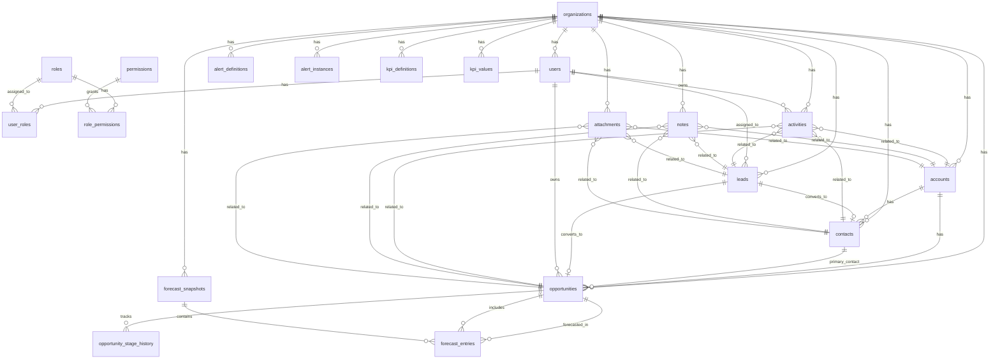

# CompassIQ Data Model
## Complete Database Schema for CRM Core + Operating Layer

**Version**: 2.0.0  
**Status**: Phase 0 - Product Spec  
**Last Updated**: December 23, 2025  
**Database**: PostgreSQL 15+ with Row Level Security (RLS)

---

## Table of Contents

1. [Entity Relationship Diagram](#entity-relationship-diagram)
2. [Core Tables](#core-tables)
3. [CRM Tables](#crm-tables)
4. [Operating Layer Tables](#operating-layer-tables)
5. [Indexes](#indexes)
6. [RLS Policies](#rls-policies)
7. [Triggers & Functions](#triggers--functions)

---

## Entity Relationship Diagram



---

## Core Tables

### organizations

Multi-tenant organization table. Every other table has `org_id` FK.

```sql
CREATE TABLE organizations (
  id UUID PRIMARY KEY DEFAULT gen_random_uuid(),
  name TEXT NOT NULL,
  legal_name TEXT,
  logo_url TEXT,
  timezone TEXT NOT NULL DEFAULT 'America/New_York',
  fiscal_year_start_month INTEGER NOT NULL DEFAULT 1, -- 1=Jan, 2=Feb, etc.
  settings JSONB NOT NULL DEFAULT '{}',
  created_at TIMESTAMPTZ NOT NULL DEFAULT NOW(),
  updated_at TIMESTAMPTZ NOT NULL DEFAULT NOW()
);

CREATE INDEX idx_organizations_name ON organizations(name);

-- Settings JSONB structure:
{
  "currency": "USD",
  "date_format": "MM/DD/YYYY",
  "default_forecast_category": "pipeline",
  "stale_opportunity_days": 7,
  "pipeline_coverage_target": 3.0
}
```

### users

User accounts linked to Supabase Auth. One user belongs to one org.

```sql
CREATE TABLE users (
  id UUID PRIMARY KEY DEFAULT gen_random_uuid(),
  org_id UUID NOT NULL REFERENCES organizations(id) ON DELETE CASCADE,
  auth_user_id UUID NOT NULL UNIQUE, -- Supabase auth.users.id
  email TEXT NOT NULL,
  first_name TEXT NOT NULL,
  last_name TEXT NOT NULL,
  phone TEXT,
  avatar_url TEXT,
  status TEXT NOT NULL DEFAULT 'active', -- active, suspended, deactivated
  last_login_at TIMESTAMPTZ,
  quota NUMERIC(12,2), -- Sales quota for AEs
  created_at TIMESTAMPTZ NOT NULL DEFAULT NOW(),
  updated_at TIMESTAMPTZ NOT NULL DEFAULT NOW(),
  created_by UUID REFERENCES users(id),
  
  CONSTRAINT users_email_org_unique UNIQUE (org_id, email),
  CONSTRAINT users_status_check CHECK (status IN ('active', 'suspended', 'deactivated'))
);

CREATE INDEX idx_users_org_id ON users(org_id);
CREATE INDEX idx_users_auth_user_id ON users(auth_user_id);
CREATE INDEX idx_users_email ON users(email);
CREATE INDEX idx_users_status ON users(status) WHERE status = 'active';
```

### roles

Predefined roles for RBAC. System roles cannot be deleted.

```sql
CREATE TABLE roles (
  id UUID PRIMARY KEY DEFAULT gen_random_uuid(),
  org_id UUID NOT NULL REFERENCES organizations(id) ON DELETE CASCADE,
  name TEXT NOT NULL, -- admin, manager, ae
  display_name TEXT NOT NULL,
  is_system_role BOOLEAN NOT NULL DEFAULT FALSE,
  created_at TIMESTAMPTZ NOT NULL DEFAULT NOW(),
  
  CONSTRAINT roles_name_org_unique UNIQUE (org_id, name)
);

CREATE INDEX idx_roles_org_id ON roles(org_id);
CREATE INDEX idx_roles_name ON roles(name);

-- Seed data: 3 system roles
INSERT INTO roles (org_id, name, display_name, is_system_role) VALUES
  (:org_id, 'admin', 'Administrator', true),
  (:org_id, 'manager', 'Sales Manager', true),
  (:org_id, 'ae', 'Account Executive', true);
```

### user_roles

Many-to-many relationship between users and roles.

```sql
CREATE TABLE user_roles (
  id UUID PRIMARY KEY DEFAULT gen_random_uuid(),
  user_id UUID NOT NULL REFERENCES users(id) ON DELETE CASCADE,
  role_id UUID NOT NULL REFERENCES roles(id) ON DELETE CASCADE,
  created_at TIMESTAMPTZ NOT NULL DEFAULT NOW(),
  created_by UUID REFERENCES users(id),
  
  CONSTRAINT user_roles_unique UNIQUE (user_id, role_id)
);

CREATE INDEX idx_user_roles_user_id ON user_roles(user_id);
CREATE INDEX idx_user_roles_role_id ON user_roles(role_id);
```

### permissions

Granular permission definitions.

```sql
CREATE TABLE permissions (
  id UUID PRIMARY KEY DEFAULT gen_random_uuid(),
  name TEXT NOT NULL UNIQUE, -- e.g., 'opportunities:update:all'
  module TEXT NOT NULL, -- sales, admin, reports
  resource TEXT NOT NULL, -- opportunities, contacts, dashboards
  action TEXT NOT NULL, -- create, read, update, delete, assign
  scope TEXT NOT NULL, -- all, team, own
  description TEXT,
  created_at TIMESTAMPTZ NOT NULL DEFAULT NOW(),
  
  CONSTRAINT permissions_name_unique UNIQUE (module, resource, action, scope)
);

CREATE INDEX idx_permissions_module ON permissions(module);
CREATE INDEX idx_permissions_resource ON permissions(resource);
```

### role_permissions

Many-to-many relationship between roles and permissions.

```sql
CREATE TABLE role_permissions (
  id UUID PRIMARY KEY DEFAULT gen_random_uuid(),
  role_id UUID NOT NULL REFERENCES roles(id) ON DELETE CASCADE,
  permission_id UUID NOT NULL REFERENCES permissions(id) ON DELETE CASCADE,
  created_at TIMESTAMPTZ NOT NULL DEFAULT NOW(),
  
  CONSTRAINT role_permissions_unique UNIQUE (role_id, permission_id)
);

CREATE INDEX idx_role_permissions_role_id ON role_permissions(role_id);
CREATE INDEX idx_role_permissions_permission_id ON role_permissions(permission_id);
```

### event_log

Immutable audit trail for all changes.

```sql
CREATE TABLE event_log (
  id UUID PRIMARY KEY DEFAULT gen_random_uuid(),
  org_id UUID NOT NULL REFERENCES organizations(id) ON DELETE CASCADE,
  user_id UUID REFERENCES users(id) ON DELETE SET NULL,
  action TEXT NOT NULL, -- create, update, delete, login, logout
  entity_type TEXT NOT NULL, -- table name
  entity_id UUID,
  old_values JSONB,
  new_values JSONB,
  ip_address INET,
  user_agent TEXT,
  created_at TIMESTAMPTZ NOT NULL DEFAULT NOW(),
  
  CONSTRAINT event_log_action_check CHECK (action IN ('create', 'update', 'delete', 'login', 'logout', 'export'))
);

CREATE INDEX idx_event_log_org_id ON event_log(org_id);
CREATE INDEX idx_event_log_user_id ON event_log(user_id);
CREATE INDEX idx_event_log_entity ON event_log(entity_type, entity_id);
CREATE INDEX idx_event_log_created_at ON event_log(created_at DESC);
CREATE INDEX idx_event_log_action ON event_log(action);

-- Partition by month for performance (optional, implement in Phase 3)
-- CREATE TABLE event_log_2025_01 PARTITION OF event_log
-- FOR VALUES FROM ('2025-01-01') TO ('2025-02-01');
```

---

## CRM Tables

### accounts

Customer companies/organizations.

```sql
CREATE TABLE accounts (
  id UUID PRIMARY KEY DEFAULT gen_random_uuid(),
  org_id UUID NOT NULL REFERENCES organizations(id) ON DELETE CASCADE,
  name TEXT NOT NULL,
  industry TEXT,
  website TEXT,
  phone TEXT,
  address_line1 TEXT,
  address_line2 TEXT,
  city TEXT,
  state TEXT,
  postal_code TEXT,
  country TEXT DEFAULT 'USA',
  owner_id UUID REFERENCES users(id) ON DELETE SET NULL,
  annual_revenue NUMERIC(15,2),
  employee_count INTEGER,
  account_type TEXT NOT NULL DEFAULT 'prospect', -- prospect, customer, churned
  last_activity_at TIMESTAMPTZ,
  tags TEXT[] DEFAULT '{}',
  custom_fields JSONB DEFAULT '{}',
  created_at TIMESTAMPTZ NOT NULL DEFAULT NOW(),
  updated_at TIMESTAMPTZ NOT NULL DEFAULT NOW(),
  created_by UUID REFERENCES users(id) ON DELETE SET NULL,
  
  CONSTRAINT accounts_type_check CHECK (account_type IN ('prospect', 'customer', 'churned'))
);

CREATE INDEX idx_accounts_org_id ON accounts(org_id);
CREATE INDEX idx_accounts_owner_id ON accounts(owner_id);
CREATE INDEX idx_accounts_name ON accounts(name);
CREATE INDEX idx_accounts_type ON accounts(account_type);
CREATE INDEX idx_accounts_last_activity ON accounts(last_activity_at DESC);
CREATE INDEX idx_accounts_tags ON accounts USING GIN(tags);
```

### contacts

People at accounts.

```sql
CREATE TABLE contacts (
  id UUID PRIMARY KEY DEFAULT gen_random_uuid(),
  org_id UUID NOT NULL REFERENCES organizations(id) ON DELETE CASCADE,
  account_id UUID REFERENCES accounts(id) ON DELETE CASCADE,
  first_name TEXT NOT NULL,
  last_name TEXT NOT NULL,
  email TEXT,
  phone TEXT,
  mobile TEXT,
  job_title TEXT,
  department TEXT,
  is_primary BOOLEAN DEFAULT FALSE,
  is_decision_maker BOOLEAN DEFAULT FALSE,
  address_line1 TEXT,
  city TEXT,
  state TEXT,
  postal_code TEXT,
  owner_id UUID REFERENCES users(id) ON DELETE SET NULL,
  lead_source TEXT, -- Original lead source
  last_activity_at TIMESTAMPTZ,
  do_not_call BOOLEAN DEFAULT FALSE,
  do_not_email BOOLEAN DEFAULT FALSE,
  tags TEXT[] DEFAULT '{}',
  custom_fields JSONB DEFAULT '{}',
  created_at TIMESTAMPTZ NOT NULL DEFAULT NOW(),
  updated_at TIMESTAMPTZ NOT NULL DEFAULT NOW(),
  created_by UUID REFERENCES users(id) ON DELETE SET NULL
);

CREATE INDEX idx_contacts_org_id ON contacts(org_id);
CREATE INDEX idx_contacts_account_id ON contacts(account_id);
CREATE INDEX idx_contacts_owner_id ON contacts(owner_id);
CREATE INDEX idx_contacts_email ON contacts(email);
CREATE INDEX idx_contacts_name ON contacts(first_name, last_name);
CREATE INDEX idx_contacts_last_activity ON contacts(last_activity_at DESC);
CREATE INDEX idx_contacts_tags ON contacts USING GIN(tags);
```

### leads

Pre-qualified prospects before conversion.

```sql
CREATE TABLE leads (
  id UUID PRIMARY KEY DEFAULT gen_random_uuid(),
  org_id UUID NOT NULL REFERENCES organizations(id) ON DELETE CASCADE,
  first_name TEXT,
  last_name TEXT,
  email TEXT,
  phone TEXT,
  company_name TEXT,
  job_title TEXT,
  lead_source TEXT NOT NULL, -- website, referral, cold_call, partner, event
  lead_source_detail TEXT, -- Campaign name, referrer name, etc.
  status TEXT NOT NULL DEFAULT 'new', -- new, contacted, qualified, unqualified, nurturing, converted, lost
  lead_score INTEGER DEFAULT 0, -- 0-100
  score_factors JSONB DEFAULT '{}',
  assigned_to UUID REFERENCES users(id) ON DELETE SET NULL,
  assigned_at TIMESTAMPTZ,
  address_line1 TEXT,
  city TEXT,
  state TEXT,
  postal_code TEXT,
  estimated_value NUMERIC(12,2),
  urgency TEXT DEFAULT 'normal', -- low, normal, high, urgent
  next_follow_up_date DATE,
  last_contacted_at TIMESTAMPTZ,
  contact_attempts INTEGER DEFAULT 0,
  converted_contact_id UUID REFERENCES contacts(id) ON DELETE SET NULL,
  converted_opportunity_id UUID REFERENCES opportunities(id) ON DELETE SET NULL,
  converted_at TIMESTAMPTZ,
  converted_by UUID REFERENCES users(id) ON DELETE SET NULL,
  lost_reason TEXT,
  lost_at TIMESTAMPTZ,
  notes TEXT,
  tags TEXT[] DEFAULT '{}',
  custom_fields JSONB DEFAULT '{}',
  created_at TIMESTAMPTZ NOT NULL DEFAULT NOW(),
  updated_at TIMESTAMPTZ NOT NULL DEFAULT NOW(),
  created_by UUID REFERENCES users(id) ON DELETE SET NULL,
  
  CONSTRAINT leads_status_check CHECK (status IN ('new', 'contacted', 'qualified', 'unqualified', 'nurturing', 'converted', 'lost')),
  CONSTRAINT leads_urgency_check CHECK (urgency IN ('low', 'normal', 'high', 'urgent'))
);

CREATE INDEX idx_leads_org_id ON leads(org_id);
CREATE INDEX idx_leads_assigned_to ON leads(assigned_to);
CREATE INDEX idx_leads_status ON leads(status);
CREATE INDEX idx_leads_created_at ON leads(created_at DESC);
CREATE INDEX idx_leads_score ON leads(lead_score DESC);
CREATE INDEX idx_leads_source ON leads(lead_source);
CREATE INDEX idx_leads_next_follow_up ON leads(next_follow_up_date) WHERE status IN ('new', 'contacted', 'qualified', 'nurturing');
CREATE INDEX idx_leads_tags ON leads USING GIN(tags);
```

### opportunities

Sales pipeline items.

```sql
CREATE TABLE opportunities (
  id UUID PRIMARY KEY DEFAULT gen_random_uuid(),
  org_id UUID NOT NULL REFERENCES organizations(id) ON DELETE CASCADE,
  account_id UUID REFERENCES accounts(id) ON DELETE SET NULL,
  contact_id UUID REFERENCES contacts(id) ON DELETE SET NULL,
  lead_id UUID REFERENCES leads(id) ON DELETE SET NULL,
  name TEXT NOT NULL,
  description TEXT,
  stage TEXT NOT NULL DEFAULT 'lead', -- lead, qualified, quote_sent, negotiation, verbal_commitment, closed_won, closed_lost
  status TEXT NOT NULL DEFAULT 'open', -- open, won, lost
  amount NUMERIC(12,2) NOT NULL DEFAULT 0,
  probability INTEGER NOT NULL DEFAULT 10, -- 0-100
  weighted_amount NUMERIC(12,2) GENERATED ALWAYS AS (amount * probability / 100.0) STORED,
  expected_close_date DATE,
  actual_close_date DATE,
  next_step TEXT, -- REQUIRED for stage progression
  next_step_date DATE, -- REQUIRED for stage progression
  owner_id UUID NOT NULL REFERENCES users(id) ON DELETE CASCADE,
  close_reason TEXT, -- Why won
  lost_reason TEXT, -- Why lost
  lost_to_competitor TEXT,
  forecast_category TEXT DEFAULT 'pipeline', -- commit, best_case, pipeline
  stage_entered_at TIMESTAMPTZ DEFAULT NOW(),
  last_activity_at TIMESTAMPTZ,
  activity_count INTEGER DEFAULT 0,
  tags TEXT[] DEFAULT '{}',
  custom_fields JSONB DEFAULT '{}',
  created_at TIMESTAMPTZ NOT NULL DEFAULT NOW(),
  updated_at TIMESTAMPTZ NOT NULL DEFAULT NOW(),
  created_by UUID REFERENCES users(id) ON DELETE SET NULL,
  
  CONSTRAINT opportunities_stage_check CHECK (stage IN ('lead', 'qualified', 'quote_sent', 'negotiation', 'verbal_commitment', 'closed_won', 'closed_lost')),
  CONSTRAINT opportunities_status_check CHECK (status IN ('open', 'won', 'lost')),
  CONSTRAINT opportunities_probability_check CHECK (probability BETWEEN 0 AND 100),
  CONSTRAINT opportunities_forecast_check CHECK (forecast_category IN ('commit', 'best_case', 'pipeline'))
);

CREATE INDEX idx_opportunities_org_id ON opportunities(org_id);
CREATE INDEX idx_opportunities_owner_id ON opportunities(owner_id);
CREATE INDEX idx_opportunities_account_id ON opportunities(account_id);
CREATE INDEX idx_opportunities_contact_id ON opportunities(contact_id);
CREATE INDEX idx_opportunities_stage ON opportunities(stage);
CREATE INDEX idx_opportunities_status ON opportunities(status);
CREATE INDEX idx_opportunities_forecast_category ON opportunities(forecast_category);
CREATE INDEX idx_opportunities_expected_close ON opportunities(expected_close_date);
CREATE INDEX idx_opportunities_open ON opportunities(org_id, status) WHERE status = 'open';
CREATE INDEX idx_opportunities_last_activity ON opportunities(last_activity_at DESC);
CREATE INDEX idx_opportunities_tags ON opportunities USING GIN(tags);
CREATE INDEX idx_opportunities_next_step_date ON opportunities(next_step_date) WHERE status = 'open';

-- Weighted pipeline calculation index
CREATE INDEX idx_opportunities_weighted_pipeline ON opportunities(org_id, weighted_amount) WHERE status = 'open';
```

### opportunity_stage_history

Track stage transitions for velocity analysis.

```sql
CREATE TABLE opportunity_stage_history (
  id UUID PRIMARY KEY DEFAULT gen_random_uuid(),
  opportunity_id UUID NOT NULL REFERENCES opportunities(id) ON DELETE CASCADE,
  from_stage TEXT,
  to_stage TEXT NOT NULL,
  changed_by UUID REFERENCES users(id) ON DELETE SET NULL,
  time_in_stage_seconds BIGINT, -- Duration in previous stage
  change_reason TEXT,
  created_at TIMESTAMPTZ NOT NULL DEFAULT NOW()
);

CREATE INDEX idx_stage_history_opportunity ON opportunity_stage_history(opportunity_id);
CREATE INDEX idx_stage_history_created ON opportunity_stage_history(created_at DESC);
CREATE INDEX idx_stage_history_to_stage ON opportunity_stage_history(to_stage);
```

### activities

Calls, emails, meetings, tasks, notes.

```sql
CREATE TABLE activities (
  id UUID PRIMARY KEY DEFAULT gen_random_uuid(),
  org_id UUID NOT NULL REFERENCES organizations(id) ON DELETE CASCADE,
  activity_type TEXT NOT NULL, -- call, email, meeting, task, note
  subject TEXT NOT NULL,
  description TEXT,
  related_to_type TEXT NOT NULL, -- account, contact, lead, opportunity
  related_to_id UUID NOT NULL,
  activity_date TIMESTAMPTZ NOT NULL DEFAULT NOW(),
  duration_minutes INTEGER,
  due_date TIMESTAMPTZ, -- For tasks
  is_completed BOOLEAN DEFAULT FALSE,
  completed_at TIMESTAMPTZ,
  priority TEXT DEFAULT 'normal', -- low, normal, high, urgent
  outcome TEXT, -- Call/meeting outcome
  owner_id UUID NOT NULL REFERENCES users(id) ON DELETE CASCADE,
  created_by UUID NOT NULL REFERENCES users(id) ON DELETE CASCADE,
  created_at TIMESTAMPTZ NOT NULL DEFAULT NOW(),
  updated_at TIMESTAMPTZ NOT NULL DEFAULT NOW(),
  
  CONSTRAINT activities_type_check CHECK (activity_type IN ('call', 'email', 'meeting', 'task', 'note')),
  CONSTRAINT activities_related_check CHECK (related_to_type IN ('account', 'contact', 'lead', 'opportunity')),
  CONSTRAINT activities_priority_check CHECK (priority IN ('low', 'normal', 'high', 'urgent'))
);

CREATE INDEX idx_activities_org_id ON activities(org_id);
CREATE INDEX idx_activities_related ON activities(related_to_type, related_to_id);
CREATE INDEX idx_activities_owner_id ON activities(owner_id);
CREATE INDEX idx_activities_due_date ON activities(due_date) WHERE is_completed = FALSE;
CREATE INDEX idx_activities_activity_date ON activities(activity_date DESC);
CREATE INDEX idx_activities_type ON activities(activity_type);
```

### notes

Rich text notes on any CRM entity.

```sql
CREATE TABLE notes (
  id UUID PRIMARY KEY DEFAULT gen_random_uuid(),
  org_id UUID NOT NULL REFERENCES organizations(id) ON DELETE CASCADE,
  related_to_type TEXT NOT NULL, -- account, contact, lead, opportunity
  related_to_id UUID NOT NULL,
  content TEXT NOT NULL,
  is_pinned BOOLEAN DEFAULT FALSE,
  created_by UUID NOT NULL REFERENCES users(id) ON DELETE CASCADE,
  created_at TIMESTAMPTZ NOT NULL DEFAULT NOW(),
  updated_at TIMESTAMPTZ NOT NULL DEFAULT NOW(),
  
  CONSTRAINT notes_related_check CHECK (related_to_type IN ('account', 'contact', 'lead', 'opportunity'))
);

CREATE INDEX idx_notes_org_id ON notes(org_id);
CREATE INDEX idx_notes_related ON notes(related_to_type, related_to_id);
CREATE INDEX idx_notes_created_by ON notes(created_by);
CREATE INDEX idx_notes_created_at ON notes(created_at DESC);
CREATE INDEX idx_notes_pinned ON notes(related_to_type, related_to_id, is_pinned) WHERE is_pinned = TRUE;
```

### attachments

File attachments on any CRM entity.

```sql
CREATE TABLE attachments (
  id UUID PRIMARY KEY DEFAULT gen_random_uuid(),
  org_id UUID NOT NULL REFERENCES organizations(id) ON DELETE CASCADE,
  related_to_type TEXT NOT NULL, -- account, contact, lead, opportunity
  related_to_id UUID NOT NULL,
  file_name TEXT NOT NULL,
  file_path TEXT NOT NULL, -- Supabase Storage path
  file_size_bytes BIGINT NOT NULL,
  content_type TEXT NOT NULL,
  uploaded_by UUID NOT NULL REFERENCES users(id) ON DELETE CASCADE,
  created_at TIMESTAMPTZ NOT NULL DEFAULT NOW(),
  
  CONSTRAINT attachments_related_check CHECK (related_to_type IN ('account', 'contact', 'lead', 'opportunity'))
);

CREATE INDEX idx_attachments_org_id ON attachments(org_id);
CREATE INDEX idx_attachments_related ON attachments(related_to_type, related_to_id);
CREATE INDEX idx_attachments_uploaded_by ON attachments(uploaded_by);
CREATE INDEX idx_attachments_created_at ON attachments(created_at DESC);
```

---

## Operating Layer Tables

### kpi_definitions

Define KPIs and how to calculate them.

```sql
CREATE TABLE kpi_definitions (
  id UUID PRIMARY KEY DEFAULT gen_random_uuid(),
  org_id UUID NOT NULL REFERENCES organizations(id) ON DELETE CASCADE,
  name TEXT NOT NULL,
  display_name TEXT NOT NULL,
  description TEXT,
  category TEXT NOT NULL, -- pipeline, conversion, velocity, activity, forecast
  calculation_sql TEXT NOT NULL, -- SQL query to calculate KPI
  target_value NUMERIC(12,2),
  target_operator TEXT, -- gt, gte, lt, lte, eq
  format TEXT DEFAULT 'number', -- number, currency, percentage, duration
  refresh_interval_minutes INTEGER DEFAULT 5,
  is_active BOOLEAN DEFAULT TRUE,
  created_at TIMESTAMPTZ NOT NULL DEFAULT NOW(),
  updated_at TIMESTAMPTZ NOT NULL DEFAULT NOW(),
  
  CONSTRAINT kpi_definitions_name_org_unique UNIQUE (org_id, name),
  CONSTRAINT kpi_definitions_category_check CHECK (category IN ('pipeline', 'conversion', 'velocity', 'activity', 'forecast')),
  CONSTRAINT kpi_definitions_operator_check CHECK (target_operator IN ('gt', 'gte', 'lt', 'lte', 'eq')),
  CONSTRAINT kpi_definitions_format_check CHECK (format IN ('number', 'currency', 'percentage', 'duration'))
);

CREATE INDEX idx_kpi_definitions_org_id ON kpi_definitions(org_id);
CREATE INDEX idx_kpi_definitions_category ON kpi_definitions(category);
CREATE INDEX idx_kpi_definitions_active ON kpi_definitions(is_active) WHERE is_active = TRUE;
```

### kpi_values

Materialized KPI values (cached for performance).

```sql
CREATE TABLE kpi_values (
  id UUID PRIMARY KEY DEFAULT gen_random_uuid(),
  org_id UUID NOT NULL REFERENCES organizations(id) ON DELETE CASCADE,
  kpi_definition_id UUID NOT NULL REFERENCES kpi_definitions(id) ON DELETE CASCADE,
  user_id UUID REFERENCES users(id) ON DELETE CASCADE, -- NULL for org-level KPIs
  period_start DATE NOT NULL,
  period_end DATE NOT NULL,
  value NUMERIC(15,4),
  metadata JSONB DEFAULT '{}', -- Additional context (e.g., breakdown by stage)
  calculated_at TIMESTAMPTZ NOT NULL DEFAULT NOW(),
  
  CONSTRAINT kpi_values_unique UNIQUE (kpi_definition_id, user_id, period_start, period_end)
);

CREATE INDEX idx_kpi_values_org_id ON kpi_values(org_id);
CREATE INDEX idx_kpi_values_definition_id ON kpi_values(kpi_definition_id);
CREATE INDEX idx_kpi_values_user_id ON kpi_values(user_id);
CREATE INDEX idx_kpi_values_period ON kpi_values(period_start, period_end);
CREATE INDEX idx_kpi_values_calculated_at ON kpi_values(calculated_at DESC);
```

### alert_definitions

Define alerts and when they should fire.

```sql
CREATE TABLE alert_definitions (
  id UUID PRIMARY KEY DEFAULT gen_random_uuid(),
  org_id UUID NOT NULL REFERENCES organizations(id) ON DELETE CASCADE,
  name TEXT NOT NULL,
  display_name TEXT NOT NULL,
  description TEXT,
  alert_type TEXT NOT NULL, -- no_next_step, no_activity, stalled, low_coverage, large_deal_at_risk
  condition_sql TEXT NOT NULL, -- SQL query that returns opportunities meeting condition
  severity TEXT NOT NULL DEFAULT 'medium', -- low, medium, high, critical
  recipients TEXT[] DEFAULT '{owner, manager}', -- owner, manager, exec
  suppress_hours INTEGER DEFAULT 24, -- Don't alert again for X hours
  is_active BOOLEAN DEFAULT TRUE,
  created_at TIMESTAMPTZ NOT NULL DEFAULT NOW(),
  updated_at TIMESTAMPTZ NOT NULL DEFAULT NOW(),
  
  CONSTRAINT alert_definitions_name_org_unique UNIQUE (org_id, name),
  CONSTRAINT alert_definitions_type_check CHECK (alert_type IN ('no_next_step', 'no_activity', 'stalled', 'low_coverage', 'large_deal_at_risk')),
  CONSTRAINT alert_definitions_severity_check CHECK (severity IN ('low', 'medium', 'high', 'critical'))
);

CREATE INDEX idx_alert_definitions_org_id ON alert_definitions(org_id);
CREATE INDEX idx_alert_definitions_type ON alert_definitions(alert_type);
CREATE INDEX idx_alert_definitions_active ON alert_definitions(is_active) WHERE is_active = TRUE;
```

### alert_instances

Individual alert occurrences.

```sql
CREATE TABLE alert_instances (
  id UUID PRIMARY KEY DEFAULT gen_random_uuid(),
  org_id UUID NOT NULL REFERENCES organizations(id) ON DELETE CASCADE,
  alert_definition_id UUID NOT NULL REFERENCES alert_definitions(id) ON DELETE CASCADE,
  opportunity_id UUID REFERENCES opportunities(id) ON DELETE CASCADE,
  user_id UUID REFERENCES users(id) ON DELETE CASCADE, -- Alert recipient
  status TEXT NOT NULL DEFAULT 'open', -- open, acknowledged, resolved, dismissed
  acknowledged_at TIMESTAMPTZ,
  resolved_at TIMESTAMPTZ,
  dismissed_at TIMESTAMPTZ,
  dismissed_reason TEXT,
  metadata JSONB DEFAULT '{}', -- Alert-specific data
  created_at TIMESTAMPTZ NOT NULL DEFAULT NOW(),
  
  CONSTRAINT alert_instances_status_check CHECK (status IN ('open', 'acknowledged', 'resolved', 'dismissed'))
);

CREATE INDEX idx_alert_instances_org_id ON alert_instances(org_id);
CREATE INDEX idx_alert_instances_definition_id ON alert_instances(alert_definition_id);
CREATE INDEX idx_alert_instances_opportunity_id ON alert_instances(opportunity_id);
CREATE INDEX idx_alert_instances_user_id ON alert_instances(user_id);
CREATE INDEX idx_alert_instances_status ON alert_instances(status) WHERE status = 'open';
CREATE INDEX idx_alert_instances_created_at ON alert_instances(created_at DESC);
```

### forecast_snapshots

Weekly forecast snapshots (Monday morning cadence).

```sql
CREATE TABLE forecast_snapshots (
  id UUID PRIMARY KEY DEFAULT gen_random_uuid(),
  org_id UUID NOT NULL REFERENCES organizations(id) ON DELETE CASCADE,
  snapshot_date DATE NOT NULL, -- Monday of the week
  fiscal_quarter TEXT NOT NULL, -- e.g., '2025-Q1'
  fiscal_year INTEGER NOT NULL, -- e.g., 2025
  snapshot_type TEXT NOT NULL DEFAULT 'weekly', -- weekly, monthly, quarterly
  notes TEXT,
  created_by UUID NOT NULL REFERENCES users(id) ON DELETE CASCADE,
  created_at TIMESTAMPTZ NOT NULL DEFAULT NOW(),
  
  CONSTRAINT forecast_snapshots_unique UNIQUE (org_id, snapshot_date, snapshot_type)
);

CREATE INDEX idx_forecast_snapshots_org_id ON forecast_snapshots(org_id);
CREATE INDEX idx_forecast_snapshots_date ON forecast_snapshots(snapshot_date DESC);
CREATE INDEX idx_forecast_snapshots_quarter ON forecast_snapshots(fiscal_quarter);
```

### forecast_entries

Individual opportunity forecasts within a snapshot.

```sql
CREATE TABLE forecast_entries (
  id UUID PRIMARY KEY DEFAULT gen_random_uuid(),
  forecast_snapshot_id UUID NOT NULL REFERENCES forecast_snapshots(id) ON DELETE CASCADE,
  opportunity_id UUID NOT NULL REFERENCES opportunities(id) ON DELETE CASCADE,
  user_id UUID NOT NULL REFERENCES users(id) ON DELETE CASCADE, -- Rep owner
  forecast_category TEXT NOT NULL, -- commit, best_case, pipeline
  rep_forecast_amount NUMERIC(12,2), -- Rep's forecast
  rep_forecast_close_date DATE,
  manager_forecast_amount NUMERIC(12,2), -- Manager override
  manager_forecast_close_date DATE,
  manager_override_reason TEXT,
  actual_amount NUMERIC(12,2), -- Actual close amount (filled in after close)
  actual_close_date DATE,
  created_at TIMESTAMPTZ NOT NULL DEFAULT NOW(),
  
  CONSTRAINT forecast_entries_unique UNIQUE (forecast_snapshot_id, opportunity_id),
  CONSTRAINT forecast_entries_category_check CHECK (forecast_category IN ('commit', 'best_case', 'pipeline'))
);

CREATE INDEX idx_forecast_entries_snapshot_id ON forecast_entries(forecast_snapshot_id);
CREATE INDEX idx_forecast_entries_opportunity_id ON forecast_entries(opportunity_id);
CREATE INDEX idx_forecast_entries_user_id ON forecast_entries(user_id);
CREATE INDEX idx_forecast_entries_category ON forecast_entries(forecast_category);
```

---

## Indexes

All indexes are already included in the table definitions above. Key performance indexes:

### High-Traffic Queries
- `opportunities.org_id, opportunities.status` (dashboard queries)
- `opportunities.owner_id` (rep dashboard)
- `opportunities.expected_close_date` (forecast queries)
- `activities.related_to_type, activities.related_to_id` (activity timelines)
- `activities.due_date` WHERE `is_completed = FALSE` (task list)

### Search & Filtering
- `accounts.name` (autocomplete)
- `contacts.email` (duplicate detection)
- `leads.lead_score DESC` (lead prioritization)
- GIN indexes on `tags` arrays (tag search)

### Audit & Compliance
- `event_log.created_at DESC` (audit reports)
- `event_log.entity_type, entity_id` (record history)

---

## RLS Policies

Every table requires Row Level Security policies. Example for `opportunities`:

```sql
-- Enable RLS
ALTER TABLE opportunities ENABLE ROW LEVEL SECURITY;

-- Helper function to get user's org_id
CREATE OR REPLACE FUNCTION get_user_org_id(auth_user_id UUID)
RETURNS UUID AS $$
  SELECT org_id FROM users WHERE auth_user_id = $1 LIMIT 1;
$$ LANGUAGE SQL STABLE;

-- Helper function to check user role
CREATE OR REPLACE FUNCTION has_role(auth_user_id UUID, role_name TEXT)
RETURNS BOOLEAN AS $$
  SELECT EXISTS (
    SELECT 1 FROM users u
    JOIN user_roles ur ON ur.user_id = u.id
    JOIN roles r ON r.id = ur.role_id
    WHERE u.auth_user_id = $1 AND r.name = $2
  );
$$ LANGUAGE SQL STABLE;

-- Policy 1: Admins and Managers can view all opportunities in their org
CREATE POLICY "admins_managers_view_all"
ON opportunities FOR SELECT
TO authenticated
USING (
  org_id = get_user_org_id(auth.uid())
  AND (
    has_role(auth.uid(), 'admin') OR 
    has_role(auth.uid(), 'manager')
  )
);

-- Policy 2: AEs can only view their own opportunities
CREATE POLICY "aes_view_own"
ON opportunities FOR SELECT
TO authenticated
USING (
  org_id = get_user_org_id(auth.uid())
  AND owner_id = (SELECT id FROM users WHERE auth_user_id = auth.uid())
  AND has_role(auth.uid(), 'ae')
);

-- Policy 3: Users can create opportunities in their org
CREATE POLICY "users_create"
ON opportunities FOR INSERT
TO authenticated
WITH CHECK (
  org_id = get_user_org_id(auth.uid())
);

-- Policy 4: Admins and Managers can update any opportunity
CREATE POLICY "admins_managers_update_all"
ON opportunities FOR UPDATE
TO authenticated
USING (
  org_id = get_user_org_id(auth.uid())
  AND (
    has_role(auth.uid(), 'admin') OR 
    has_role(auth.uid(), 'manager')
  )
);

-- Policy 5: AEs can only update their own opportunities
CREATE POLICY "aes_update_own"
ON opportunities FOR UPDATE
TO authenticated
USING (
  org_id = get_user_org_id(auth.uid())
  AND owner_id = (SELECT id FROM users WHERE auth_user_id = auth.uid())
  AND has_role(auth.uid(), 'ae')
);

-- Policy 6: Only admins can delete opportunities
CREATE POLICY "admins_delete"
ON opportunities FOR DELETE
TO authenticated
USING (
  org_id = get_user_org_id(auth.uid())
  AND has_role(auth.uid(), 'admin')
);
```

**Note**: Apply similar policies to all other tables (`accounts`, `contacts`, `leads`, `activities`, etc.).

---

## Triggers & Functions

### Trigger: Update `updated_at` timestamp

```sql
CREATE OR REPLACE FUNCTION update_updated_at_column()
RETURNS TRIGGER AS $$
BEGIN
  NEW.updated_at = NOW();
  RETURN NEW;
END;
$$ LANGUAGE plpgsql;

-- Apply to all tables with updated_at
CREATE TRIGGER update_accounts_updated_at BEFORE UPDATE ON accounts
  FOR EACH ROW EXECUTE FUNCTION update_updated_at_column();

CREATE TRIGGER update_contacts_updated_at BEFORE UPDATE ON contacts
  FOR EACH ROW EXECUTE FUNCTION update_updated_at_column();

CREATE TRIGGER update_leads_updated_at BEFORE UPDATE ON leads
  FOR EACH ROW EXECUTE FUNCTION update_updated_at_column();

CREATE TRIGGER update_opportunities_updated_at BEFORE UPDATE ON opportunities
  FOR EACH ROW EXECUTE FUNCTION update_updated_at_column();

CREATE TRIGGER update_users_updated_at BEFORE UPDATE ON users
  FOR EACH ROW EXECUTE FUNCTION update_updated_at_column();

-- ... repeat for all tables with updated_at
```

### Trigger: Log opportunity stage changes

```sql
CREATE OR REPLACE FUNCTION log_opportunity_stage_change()
RETURNS TRIGGER AS $$
BEGIN
  IF OLD.stage IS DISTINCT FROM NEW.stage THEN
    INSERT INTO opportunity_stage_history (
      opportunity_id,
      from_stage,
      to_stage,
      changed_by,
      time_in_stage_seconds
    ) VALUES (
      NEW.id,
      OLD.stage,
      NEW.stage,
      NEW.updated_by, -- Assumes updated_by is set in application
      EXTRACT(EPOCH FROM (NOW() - OLD.stage_entered_at))
    );
    
    -- Update stage_entered_at
    NEW.stage_entered_at = NOW();
  END IF;
  
  RETURN NEW;
END;
$$ LANGUAGE plpgsql;

CREATE TRIGGER log_opportunity_stage_change_trigger
BEFORE UPDATE ON opportunities
FOR EACH ROW
EXECUTE FUNCTION log_opportunity_stage_change();
```

### Trigger: Update `last_activity_at` on related entities

```sql
CREATE OR REPLACE FUNCTION update_last_activity_at()
RETURNS TRIGGER AS $$
BEGIN
  -- Update last_activity_at on related entity
  IF NEW.related_to_type = 'account' THEN
    UPDATE accounts SET last_activity_at = NEW.activity_date WHERE id = NEW.related_to_id;
  ELSIF NEW.related_to_type = 'contact' THEN
    UPDATE contacts SET last_activity_at = NEW.activity_date WHERE id = NEW.related_to_id;
  ELSIF NEW.related_to_type = 'lead' THEN
    UPDATE leads SET last_contacted_at = NEW.activity_date WHERE id = NEW.related_to_id;
  ELSIF NEW.related_to_type = 'opportunity' THEN
    UPDATE opportunities 
    SET last_activity_at = NEW.activity_date, 
        activity_count = activity_count + 1 
    WHERE id = NEW.related_to_id;
  END IF;
  
  RETURN NEW;
END;
$$ LANGUAGE plpgsql;

CREATE TRIGGER update_last_activity_at_trigger
AFTER INSERT ON activities
FOR EACH ROW
EXECUTE FUNCTION update_last_activity_at();
```

### Trigger: Write audit log on changes

```sql
CREATE OR REPLACE FUNCTION write_audit_log()
RETURNS TRIGGER AS $$
BEGIN
  IF TG_OP = 'INSERT' THEN
    INSERT INTO event_log (org_id, user_id, action, entity_type, entity_id, new_values)
    VALUES (NEW.org_id, NEW.created_by, 'create', TG_TABLE_NAME, NEW.id, to_jsonb(NEW));
  ELSIF TG_OP = 'UPDATE' THEN
    INSERT INTO event_log (org_id, user_id, action, entity_type, entity_id, old_values, new_values)
    VALUES (NEW.org_id, NEW.updated_by, 'update', TG_TABLE_NAME, NEW.id, to_jsonb(OLD), to_jsonb(NEW));
  ELSIF TG_OP = 'DELETE' THEN
    INSERT INTO event_log (org_id, user_id, action, entity_type, entity_id, old_values)
    VALUES (OLD.org_id, NULL, 'delete', TG_TABLE_NAME, OLD.id, to_jsonb(OLD));
  END IF;
  
  RETURN NULL;
END;
$$ LANGUAGE plpgsql;

-- Apply to all core tables
CREATE TRIGGER accounts_audit_trigger
AFTER INSERT OR UPDATE OR DELETE ON accounts
FOR EACH ROW EXECUTE FUNCTION write_audit_log();

CREATE TRIGGER contacts_audit_trigger
AFTER INSERT OR UPDATE OR DELETE ON contacts
FOR EACH ROW EXECUTE FUNCTION write_audit_log();

CREATE TRIGGER opportunities_audit_trigger
AFTER INSERT OR UPDATE OR DELETE ON opportunities
FOR EACH ROW EXECUTE FUNCTION write_audit_log();

-- ... repeat for all core tables
```

---

## Migration Strategy

### Phase 1: Core Tables (Week 1)
1. `organizations`
2. `users`, `roles`, `user_roles`, `permissions`, `role_permissions`
3. `event_log`

### Phase 2: CRM Tables (Week 1-2)
1. `accounts`
2. `contacts`
3. `leads`
4. `opportunities`, `opportunity_stage_history`
5. `activities`
6. `notes`, `attachments`

### Phase 3: Operating Layer Tables (Week 3-4)
1. `kpi_definitions`, `kpi_values`
2. `alert_definitions`, `alert_instances`
3. `forecast_snapshots`, `forecast_entries`

### Phase 4: Indexes & RLS (Week 4)
1. Add all indexes
2. Add all RLS policies
3. Add all triggers
4. Test performance

---

## Document History

| Version | Date | Author | Changes |
|---------|------|--------|---------|
| 2.0.0 | 2025-12-23 | System | Complete rewrite for CRM Core + Operating Layer |

---

**Next Document**: `STAGE_DEFINITIONS.md` - Pipeline stages with required fields

